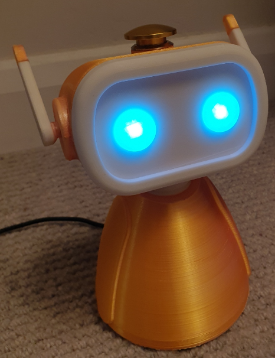
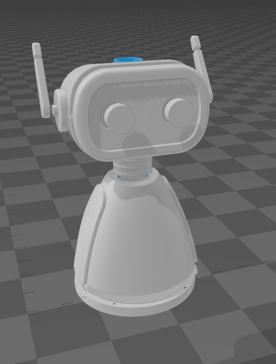
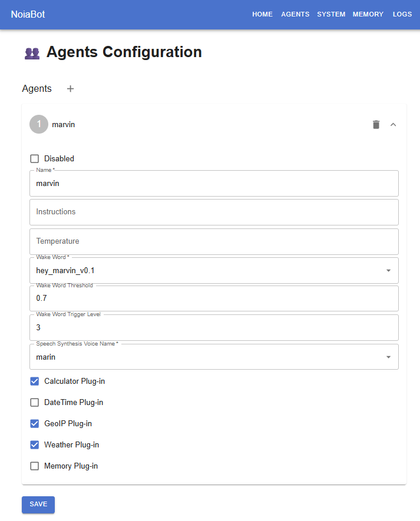
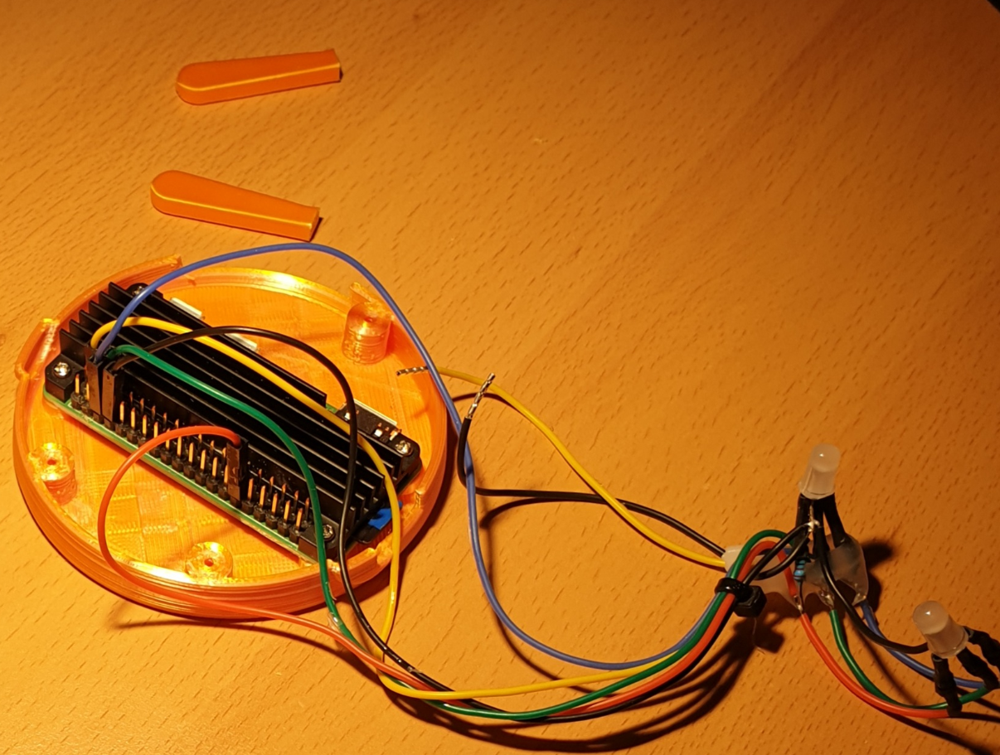
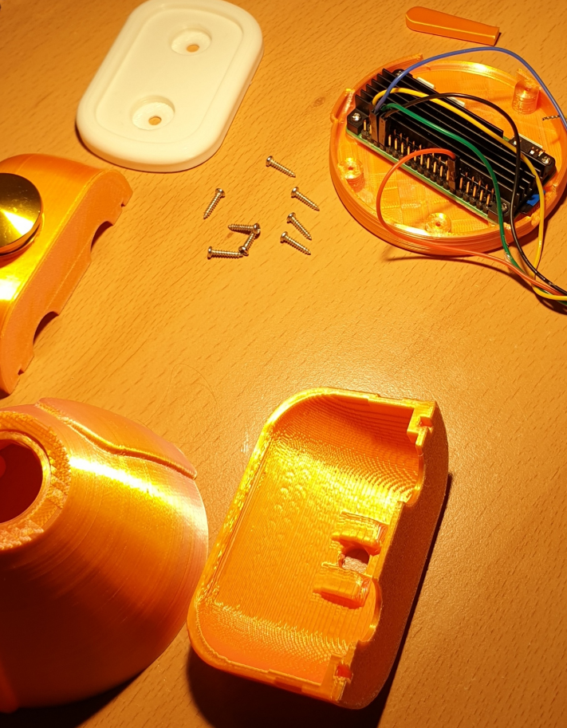

# NoiaBot


**NoiaBot** is a free, Raspberry Pi powered **real-time** AI chat robot. It is ideal for **teaching assistance**. It can answer or help clarify challenging questions on a wide range of subjects and serve as a live encyclopedia. 

Its focus on real-time aspects, allows it to keep a highly responsive live conversational experience with the user. It allows user interruptions (barge-in) while the robot is still speaking and maintaining the correct live conversation state context.

It is optimised to run efficiently on the little CPU and RAM resources of the `Raspberry Pi Zero 2 W`, but can also run on desktop (Windows and Linux) for testing and evaluation. It requires a 64-bit ARM CPU so it will not run on the less capable Pi Zero 1, Pi 1 and Pi 2 devices.

Its basic core AI capability is provided by the [OpenAI Platform](https://platform.openai.com/) so it requires an OpenAI user account and an associated API key token. It uses the [Semantic Kernel](https://learn.microsoft.com/en-us/semantic-kernel/overview/) engine with custom plug-ins to enhance its AI capabilities and also the [ONNX](https://onnxruntime.ai/) engine with local AI inference models for fully offline wake-word detection and fully offline voice detection (VAD).

<a href="image-0.png"></a> <a href="image-8.png"></a> 

**Configuration Web page:**

<a href="image-2.png"></a>

**Real-time chat example:**

https://github.com/user-attachments/assets/f00467bd-f123-4fde-8da9-e328a8ddb24d

## Features

It is activated by configurable wake words or the *talk/hangup* button on its head. 

The wake-word AI engine **runs 100% locally** on the CPU (without sending anything over the Internet, for privacy). It includes a set of preconfigured, selectable wake-words (alexa, hey_jarvis, hey_marvin, hey_mycroft) as part of the [NanoWakeWord](https://github.com/samartzidis/NanoWakeWord) engine that was especially developed for NoiaBot. 

It self-controls its 2 RGB LEDs for changing eye colours via the Raspberry Pi *GPIO* interface, based on its status and current interaction with the user.

NoiaBot has tool capabilities such as: 
- A RAG memory tool for persistent semantic memory.
- Knowing about the current date and time.
- Live weather and GeoIP-based location awareness.
- A scientific calculator tool (for math operations).
- Controls its eyes colour and responds to various user commands such as: "turn off", "restart", "volume up/down", "volume 8" (ranging from 0-10), etc.
- A simple Web configuration page for configuring it remotely from a mobile phone etc.

## Operation

#### Eye Colours Legend

- **Off** - The robot is off.
- **White** - The robot is on standby.
- **Yellow** - The robot has detected sound activity (**local** noise detection engine activated).
- **Orange** - The robot has detected a configured wake-up word (both **local** VAD and **local** wake word inference engines activated) and is initializing for live conversation.
- **Green** - Live conversation is active. The robot is now listening and is ready to respond (a live Web socket connection is streaming further conversation over the internet to your OpenAI account).
- **Flashing Green** - The robot is talking, using a Peak Level Meter visualisation.
- **Blue** - The robot is invoking one of its internal plug-ins.
- **Red** - An error has occurred. If it is a transient error, e.g. an external API timeout, it will automatically recover. If not, you may want to inspect the logs (via the management Web-page or the SSH).

## Hardware Build Components and Specific Requirements

- A **Raspberry Pi Zero 2 W** with a soldered GPIO header (you might as well purchase the Raspberry Pi Zero 2 WH).
- An **Anker PowerConf S330** speakerphone or a similar speakerphone with *acoustic echo cancellation* (AEC), or alternatively a plain USB headset connected directly to the Raspberry Pi USB port.
- Optional but highly recommended - a **heatsink**. A recommended heatsink is [Geekworm Raspberry Pi Zero 2 W Heatsink](https://www.amazon.co.uk/dp/B09QMBCXLB). Ideally install it using the thermal heatsink paste option instead of the included heatsink pad.
- 5mm round common cathode **RGB LEDs** for the robot eyes.
- Multicoloured 28AWG (ideally silicone) **cables**.
- For making the custom length connector cables, a kit of several female **Dupont 2.54 mm pitch 1-Pin connectors** such as [these](https://www.amazon.co.uk/dp/B096DC1J3X) and an equivalent crimping tool such as [this one](https://www.amazon.co.uk/dp/B01N4L8QMW).
- A **19mm momentary push-button** to place on the robot's head. E.g. [this one](https://www.amazon.co.uk/dp/B0DB2BYQKW).
- A self tapping **M2 screws**. Specifically: 4x 13mm and 4x 11mm. You can also get one of [these sets](https://www.amazon.co.uk/dp/B09NDMWBC2).
- 6x 220K **resistors** for each one of the 2 RGB LEDs anode (+) pins.

Printing will take several hours but it's relatively straightforward. Supports are not required but use **brim** (build plate andhesion setting) to prevent warping at the edges. You will also need a regular **epoxy glue** to glue the parts together.

A genuinely at least 2A and 5V micro-USB power supply to power the Pi board will be needed (or weird failures will happen during operation if weaker power supply used).

<a href="20260201205437.png"></a> <a href="20260201205724.png"></a>

## GPIO Interface Hardware Connections

- **Ground** (physical **Pin 34**) ⇒ Push **button** terminal 1 (of 2) and to the 2 RGB LED common cathode pins.
- **GPIO 18** (physical **Pin 12**) ⇒ **Red** RGB LED pins via 220K resistors. (Hardware PWM0)
- **GPIO 19** (physical **Pin 35**) ⇒ **Green** RGB LED pins via 220K resistors. (Hardware PWM1)
- **GPIO 16** (physical **Pin 36**) ⇒ **Blue** RGB LED pins via 220K resistors. (Simple GPIO output, no PWM)
- **GPIO 26** (physical **Pin 37**) ⇒ Push **button** terminal 2 (of 2).

<a href="pi0-pinout.png"></a>

## Raspberry Pi OS Platform Preparation

1. Install the latest [Raspberry Pi OS Lite (64-bit)](https://www.raspberrypi.com/software/operating-systems/) Operating System, currently Debian version: 12 (bookworm), on the `Raspberry Pi Zero 2 W` device configuring WiFi network connectivity with internet access. Use the [Raspberry Pi Imager](https://www.raspberrypi.com/software/).
2. After finishing installation, SSH to the Pi and install the required OS packages via:
    `sudo apt-get install libasound2-dev`
3. Disable the Raspberry Pi on-board audio functionality and enable the pwm overlay:
    Edit: `/boot/firmware/config.txt`
    Add these lines in the end: 
    ```
    dtoverlay=vc4-kms-v3d,noaudio
    dtoverlay=pwm-2chan
    ```
4. Also add this line to minimise the GPU memory usage: `gpu_mem=32`
5. Edit: `/etc/NetworkManager/NetworkManager.conf` and add the lines: 
    ```
    [connection]
    # Values are 0 (use default), 1 (ignore/don't touch), 2 (disable) or 3 (enable).
    wifi.powersave = 2
    ```
6. Reboot.
7. You can now connect the USB sound card to the USB port and use the `alsamixer` command to check if it is detected and if everything looks right. You should also adjust the mic sensitivity.
8. Install the .NET 8 platform in the `/opt/dotnet8` directory, by following the official installation guides for the Raspberry Pi (e.g. https://learn.microsoft.com/en-us/dotnet/iot/deployment). Also set the following at the bottom of `/etc/profile`:
   ```
   export DOTNET_ROOT=/opt/dotnet8
   export PATH="$DOTNET_ROOT:$PATH"
   ```
   The DOTNET_ROOT environment variable is needed when running .NET executables published as a single file, so it is best to set it as well.
9. Ensure that the `dotnet` command is in the PATH of the `pi` user.

## Software Installation and Configuration

1. Create the directory `/home/pi/noiabot` and copy/extract the release build files there.
2. Check if NoiaBot works when running from the console by running: `./NoiaBot`.
3. Now install NoiaBot as a service. Create and edit the file `/etc/systemd/system/noiabot.service` with the following content:
    ```
    [Unit]
    Description=noiabot service

    [Service]
    Environment=DOTNET_ROOT=/opt/dotnet8
    Environment=PATH=/opt/dotnet8:/usr/bin:/bin
    ExecStart=/home/pi/noiabot/NoiaBot
    WorkingDirectory=/home/pi/noiabot/
    User=pi

    [Install]
    WantedBy=default.target
    ```
4. Enable and start the `noiabot` service:
    ```
    systemctl enable noiabot.service
    systemctl start noiabot
    ```

Optionally, add permissions to user `pi` to open hidraw devices. Only needed if using an external USB speakerphone (such as the *Anker PowerConf S330*) for enabling control of the consumer controls (buttons) and lights. Create and edit the file: `/etc/udev/rules.d/99-hidraw-permissions.rules` and set the content:
   ```
   KERNEL=="hidraw*", SUBSYSTEM=="hidraw", MODE="0660", GROUP="pi"
   ```
   Save the file and exit.
   Reload rules and re-trigger:
   ```
   sudo udevadm control --reload-rules
   sudo udevadm trigger
   ```

### Captive Portal Device Software Installation (Optional)

You can optionally install Captive Portal Device software so that whenever NoiaBot loses network connectivity or needs to connect to a new WiFi network, you can do it remotely using your mobile phone or PC by connecting to NoiaBot directly (NoiaBot switches to Access Point mode). The following installation instructions are based on Raspberry Pi OS (64-bit) 13 (trixie):

1. Setup the [WiFi Connect](https://github.com/balena-os/wifi-connect) utility by typing the following commands:
    ```sh
    mkdir -p /home/pi/wifi-connect/ui
    wget https://github.com/balena-os/wifi-connect/releases/download/v4.11.84/wifi-connect-ui.tar.gz
    wget https://github.com/balena-os/wifi-connect/releases/download/v4.11.84/wifi-connect-aarch64-unknown-linux-gnu.tar.gz
    tar -xzf wifi-connect-ui.tar.gz -C /home/pi/wifi-connect/ui
    tar -xzf wifi-connect-aarch64-unknown-linux-gnu.tar.gz -C /home/pi/wifi-connect
    chmod +x /home/pi/wifi-connect/wifi-connect
    rm wifi-connect-ui.tar.gz wifi-connect-aarch64-unknown-linux-gnu.tar.gz
    ```
2. Create the file: `/etc/systemd/system/wifi-connect.service` with the following content:
   ```sh
   [Unit]
   Description=NoiaBot WiFi Connect captive portal
   After=NetworkManager.service network-online.target
   Wants=network-online.target

   [Service]
   Type=simple
   User=root
   WorkingDirectory=/home/pi/wifi-connect

   # Only start portal when Wi-Fi is NOT already connected
   ExecStart=/bin/bash -lc '\
   if nmcli -t -f WIFI general | grep -q enabled && \
       nmcli -t -f DEVICE,TYPE,STATE dev status | grep -q ":wifi:connected$"; then \
       echo "WiFi already connected; not starting wifi-connect"; \
       exit 0; \
   fi; \
   exec ./wifi-connect -a 300 -s "NoiaBot WiFi Connect" \
   '

   Restart=on-failure
   RestartSec=5

   [Install]
   WantedBy=multi-user.target
   ```
3. Enable the wifi-connect service and reboot by typing:
   ```sh
   sudo systemctl enable wifi-connect.service    
   sudo reboot
   ```
After reboot, and provided that NoiaBot is **not already connected** to a WiFi network, a new WiFi network available named `NoiaBot WiFi Connect` will become available. You can connect to this network using a mobile phone or a PC to configure the client-mode WiFi network connection of NoiaBot. Once NoiaBot connects to the specified WiFi network as a client, it will switch to client mode and the `NoiaBot WiFi Connect` access point will dissapear.

## License and Acknowledgements

NoiaBot is licensed under the [MIT license](../LICENSE).

The NoiaBot [NanoWakeWord](https://github.com/samartzidis/NanoWakeWord) wake-word detection engine is powered by the [ONNX Runtime](https://onnxruntime.ai/) and was based on the [openWakeWord](https://github.com/dscripka/openWakeWord) project.

The NoiaBot 3d printable shell was remixed from the _Wee-bo_ robot model by _Sparrows89_.

## Disclaimer

This software and documentation are provided "as-is" without any warranties, express or implied, including but not limited to warranties of merchantability, fitness for a particular purpose, or non-infringement. The authors and contributors shall not be liable for any damages, including but not limited to direct, indirect, incidental, special, consequential, or punitive damages arising out of the use or inability to use this software or documentation, even if advised of the possibility of such damages.

Use of this software is at your own risk. The authors and contributors assume no responsibility for any damage, injury, or loss that may result from the use, misuse, or inability to use this software or the associated hardware components.

